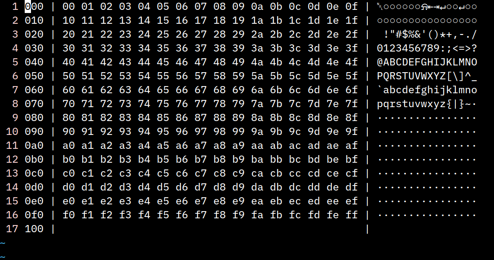

# Vim Hex

This plugin can transform Vim into a nifty hex editor.



## Description

Files opened as binary files (with the `-b` tag) are edited in hex instead of the normal way.

They are showed in a format similar to `xxd`'s with on the left, the offset of each line in bytes, in the middle, the bytes to edit, and in the right, a render of the content. The offset and the render are only here as hints. They don't have any meaning. Thus, you are free to add new bytes in a line, remove them, or add a new line with new bytes. Changing the offset hint or the render don't have any effect.

In lines, any characters before the first `|` if there is one and after the second `|` are ignored when saving. The leftover character must only be white-space and hexadecimal digits. If any other character is present, an error is raised and the file will not properly be saved. All hex numbers must be in pairs to form bytes. There is no option to edit words larger than 8 bits.

## Installation

To use this plugin, you must have Vim compiled with Lua support.

Simply install this plugin like any other plugin. For example, with Pathogen, copy this repository in you `bundle/` directory.

## Speed boost

The plugin can work while only executing Lua and Vimscript. It works but it can be somewhat slow on big files. To minimize this issue, some of the most expensive functions have been written in C as well. To use them, simply use `make` to compile them. For it to work, you need to have a Lua environment compatible with the Lua interpreter embedded in Vim.

By doing so, you can expect a 5.5 times speed upgrade for reading files and a 2.1 times speed upgrade for writing files.

## Automatically open binary files

You might want some files to be opened as hex dump without having to give the `-b` flag to Vim. For example, `.bin` or `.exe` files. You can do that by adding the following lines in your vimrc:

```
" Consider *.bin and *.exe files as binaries
augroup Binary
  au!
  au BufReadPre,FileReadPre,BufNewFile *.bin let &bin=1
  au BufReadPre,FileReadPre,BufNewFile *.exe let &bin=1
augroup END
```

That way, `.bin` and `.exe` files are always opened with Vim Hex; even without the `-b` flag. To open more file types with Vim Hex, simply add a new line for each file extension in the augroup.

## Road-map

* Color.

